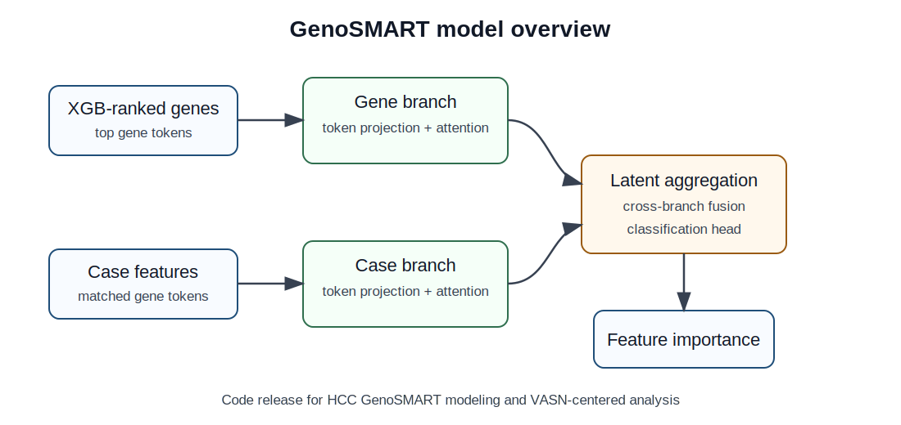
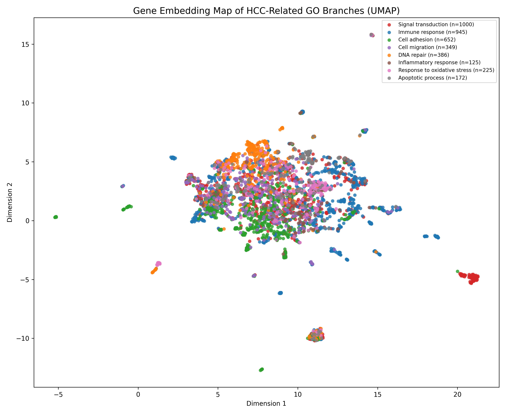

# GenoSMART

GenoSMART is a transformer-based modeling framework for HCC transcriptomic feature learning and VASN-centered feature-importance analysis. This repository contains the model definitions, training/evaluation utilities, and example result summaries used for the GenoSMART analyses.

> Note: This public repository is prepared as a lightweight code release. Large feature matrices, raw data, and model checkpoints are not included. Place downloaded or generated data under the expected local data folders before running the training scripts.

## Repository Structure

```text
GenoSMART/
  models/                 Transformer and GenoSMART model definitions
  data/                   Dataset loaders for dual-branch HCC features
  scripts/                Training, evaluation, ablation, and importance scripts
  docs/                   Model overview and example figures
  results_examples/       Small example summaries and VASN rank outputs
  train.py                Core training and evaluation utilities
  requirements.txt        Python dependencies
```

## Model Overview

GenoSMART uses two feature branches to integrate ranked gene-level information and case-level transcriptomic representations, followed by latent token aggregation and classification.



An example HCC GO-branch embedding visualization is also included:



## Installation

We recommend Python 3.10 or later.

```bash
git clone https://github.com/sangst-lab/GenoSMART.git
cd GenoSMART
python -m venv .venv
source .venv/bin/activate  # Windows: .venv\Scripts\activate
pip install -r requirements.txt
```

For GPU training, install the PyTorch build that matches your CUDA version from the official PyTorch installation page.

## Data Layout

The original project used preprocessed HCC feature arrays generated from transcriptomic data. A typical local layout is:

```text
features_genept_ada_dualparts_globalnorm/
  raw_1/
    train/
    val/
    test/
  gene_order_top2000_from_xgb_matched.txt

saved_models_dl_dual/
  *.pt
```

These folders are intentionally excluded from GitHub because they can be large and may depend on external data-use terms.

## Basic Usage

Train or evaluate from the repository root after placing the expected feature folders locally:

```bash
python train.py
python scripts/run_genosmart_partial_test_neutral_importance.py
python scripts/run_genosmart_all_splits_target_auc084_importance.py
```

Some legacy scripts preserve project-specific paths from the analysis workspace. Update `PROJECT_ROOT`, `RAW_DIR`, or checkpoint paths in the corresponding script before running them in a new environment.

## Example Outputs

Small example output summaries are provided under `results_examples/`, including VASN rank summaries and a neutral partial-test run summary.

## Code Availability Text

Suggested manuscript wording:

```text
The source code for the GenoSMART model architecture, training workflow, and VASN-centered feature-importance analyses is available at https://github.com/sangst-lab/GenoSMART.
```

Place this sentence in the manuscript `Data and Code Availability` section, or at the end of the `Methods` section if the journal does not use a separate availability section.

## Citation

If you use this repository, please cite the associated manuscript.

## License

No license has been specified yet. Please contact the authors for reuse permissions until a license is added.
